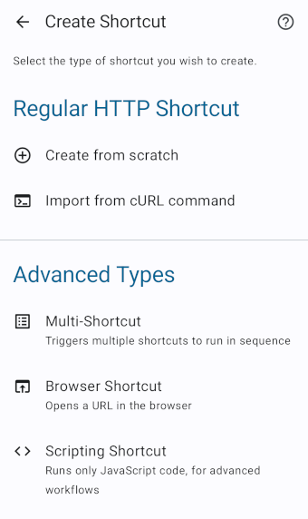

# Shortcuts

The *HTTP Shortcuts* app allows you to create *shortcuts* that represent an action, resource or workflow. They can be invoked (executed) by clicking them, either inside the app itself, or after placing them on your device's home screen as widgets.

Get started by clicking the *plus button* at the bottom right when opening the app and pick which type of shortcut you want to create. For each shortcut you can set a name, an icon and a description. Depending on the type, there's a number of additional options.

Once you've create a shortcut, it will appear on the app's main screen. You can long-press it to open its context menu, which includes options such as editing, exporting, deleting, etc.

## Regular HTTP Shortcuts

The main purpose of the app is to make it easy to send HTTP requests, so the main type of shortcut is a regular HTTP shortcut. For this at the very least you need to specify an HTTP method (e.g. GET, POST, PUT, ...) and the URL that you want to reach (e.g. an API endpoint, a hosted text document or a website).

You will also find a number of options, such as custom request headers, request body settings, or how the response should be displayed. You will also find more advanced features like proxy settings or [scripting](scripting.md).

See the [Execution Flow](execution-flow.md) page for more information on how a shortcut is executed.

### Import from cURL

Instead of starting from scratch you can use the *"Import from cURL"* option to type or paste an existing cURL command which then serves as a template for your shortcut.

## Other Types of Shortcuts

In some cases you need to create shortcuts that don't correspond to a single HTTP request but instead need to perform a different workflow.

### Multi-Shortcut

A *multi-shortcut* combines multiple shortcuts into one. When the multi-shortcut is executed it will trigger all of the shortcuts that are linked to it in sequence.

### Browser Shortcut

A *browser shortcut* is similar to a regular HTTP shortcut in that it corresponds to a single URL, but instead of making an HTTP request directly to that URL inside the app, it will open the URL in your device's browser instead.

### MQTT Shortcut

An *MQTT shortcut* lets you send one or multiple messages to an MQTT server, using the [MQTT protocol](https://en.wikipedia.org/wiki/MQTT). Each message consists of the topic that the message should be published to, and its payload.

You'll need to know the MQTT server's URL, which is specified using the "tcp://"-Scheme, so, if your server is running on 192.168.0.42 at port 1234, then the URL you'd use is "tcp://192.168.0.42:1234".

Optionally, you can also configure a username and password if the server requires authentication.

### Wake-on-LAN Shortcut

A *wake-on-lan shortcut* can be used to wake up a computer or other device on your network. Check online whether your computer (and specifically its network card) supports this, how to enable it and how to find out its MAC address.

### Scripting Shortcut

A *scripting shortcut* allows you to run arbitrary JavaScript code, also known as [scripting](scripting.md).

